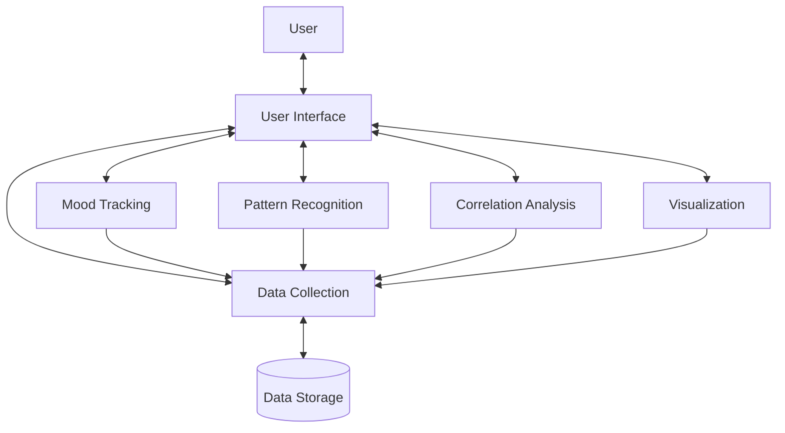

# Mental Health Pattern Recognition Assistant

[]()
[]()

<div align="center">


[](https://opensource.org/licenses/MIT)
[](https://www.python.org/downloads/)

**Discover patterns in your mental health data through advanced analysis and visualization**

[Features](#key-features) • [Screenshots](#screenshots) • [Installation](#installation) • [Usage](#usage) • [Documentation](#documentation) • [Contributing](#contributing) • [License](#license)

</div>

## Overview

The Mental Health Pattern Recognition Assistant is a powerful tool designed to help individuals track, analyze, and visualize their mental health data. By identifying patterns and correlations between various factors affecting mental wellbeing, the application provides personalized insights that can help users make informed decisions about their mental health.

Unlike generic mood tracking apps, this assistant uses advanced statistical analysis and pattern recognition algorithms to uncover hidden relationships between your activities, sleep, medication, and mood - helping you understand what truly impacts your mental wellbeing.

## Key Features

- **Comprehensive Data Collection**
  - Track mood levels (1-10) with associated emotions
  - Record activities with duration and intensity
  - Log sleep quality and duration
  - Track medication intake and adherence
  - Create custom tracking categories

- **Advanced Pattern Recognition**
  - Identify time-based patterns (time of day, day of week)
  - Detect trends and cycles in mood over time
  - Recognize mood clusters and distinct patterns
  - Analyze correlations between activities and mood
  - Perform lagged correlation analysis to identify delayed effects

- **Insightful Visualizations**
  - Generate mood timelines and emotion distributions
  - Create correlation visualizations between different factors
  - Produce comprehensive dashboards with key insights
  - Visualize weekly and monthly patterns

- **Personalized Insights**
  - Receive data-driven insights about your mental health patterns
  - Get suggestions for potential mood-improving activities
  - Understand your unique emotional patterns and triggers
  - Identify factors that consistently impact your wellbeing

## Screenshots

<div align="center">
<i>Screenshots will be added soon</i>
</div>

## Installation

### Prerequisites

- Python 3.6 or higher
- Required Python packages:
  - numpy
  - pandas
  - matplotlib
  - seaborn
  - scipy
  - scikit-learn
  - statsmodels
  - tabulate

### Step-by-Step Installation

1. **Clone the repository**
   ```bash
   git clone https://github.com/yourusername/mental-health-pattern-app.git
   cd mental-health-pattern-app
   ```

2. **Create a virtual environment (recommended)**
   ```bash
   python -m venv venv
   
   # On Windows
   venv\Scripts\activate
   
   # On macOS/Linux
   source venv/bin/activate
   ```

3. **Install the required packages**
   ```bash
   pip install -r requirements.txt
   ```

## Usage

### Basic Usage

Run the application:
```bash
python main.py
```

### Demo Mode

To explore the application with pre-populated demo data:
```bash
python main.py --demo
```

### Common Commands

Once the application is running, you can:
- Enter `1` to record new data
- Enter `2` to view your data
- Enter `3` to run analyses
- Enter `4` to generate visualizations
- Enter `5` to view insights
- Enter `6` to configure settings
- Enter `0` to exit

## Documentation

The project documentation is organized in the `memory-bank` directory:

- `projectbrief.md`: Core requirements and goals
- `productContext.md`: Why this project exists and problems it solves
- `systemPatterns.md`: System architecture and design patterns
- `techContext.md`: Technologies used and technical constraints
- `activeContext.md`: Current work focus and next steps
- `progress.md`: Current status and what's left to build

## System Architecture

The application follows a modular architecture with clear separation of concerns:



## Contributing

Contributions are welcome! Please feel free to submit a Pull Request.

1. Fork the repository
2. Create your feature branch (`git checkout -b feature/amazing-feature`)
3. Commit your changes (`git commit -m 'Add some amazing feature'`)
4. Push to the branch (`git push origin feature/amazing-feature`)
5. Open a Pull Request

Please read [CONTRIBUTING.md](CONTRIBUTING.md) for details on our code of conduct and the process for submitting pull requests.

## Enhanced UI Version

The project now includes an enhanced web-based UI with interactive features:

- **Interactive Animations**: Smooth transitions and micro-interactions for improved user experience
- **Audio Feedback**: Sound effects and voice announcements provide multi-sensory feedback
- **Gamification Elements**: Points system and streak tracking with visual celebrations
- **Responsive Design**: Works across desktop and mobile devices

### Running the Enhanced UI

To run the enhanced web version:

1. Navigate to the `web` directory
2. Run the demo script:
   ```bash
   # On Windows
   run-demo.bat
   
   # On macOS/Linux
   ./run-demo.sh
   ```

This will start both the backend server and the React web application.

For more details about the enhanced UI, see the [enhanced-ui.md](web/docs/enhanced-ui.md) documentation.

## Mobile Demo

A mobile demo application has been developed to provide on-the-go access:

- **React Native Implementation**: Built with React Native and Expo
- **Cross-Platform**: Works on iOS and Android
- **Core Functionality**: Provides mood tracking with a gamified experience

## Roadmap

- **Short-term** ✓
  - ✓ Enhanced command-line interface
  - ✓ Improved visualization aesthetics
  - ✓ Web-based interface
  - ✓ Mobile demo application

- **Medium-term**
  - Full-featured mobile application
  - Data export in multiple formats
  - Integration with common health tracking apps
  - Enhanced audio and animation features

- **Long-term**
  - Machine learning enhancements
  - Integration with wearable devices
  - Voice-driven interaction
  - Expanded visualization options

## License

This project is licensed under the MIT License - see the [LICENSE](LICENSE) file for details.

## Acknowledgments

- This project was created to help individuals better understand and manage their mental health
- Inspired by research on the benefits of mood tracking and pattern recognition in mental health management
- Thanks to all contributors who have helped shape this project

## Contact

Project Link: [https://github.com/yourusername/mental-health-pattern-app](https://github.com/yourusername/mental-health-pattern-app)
