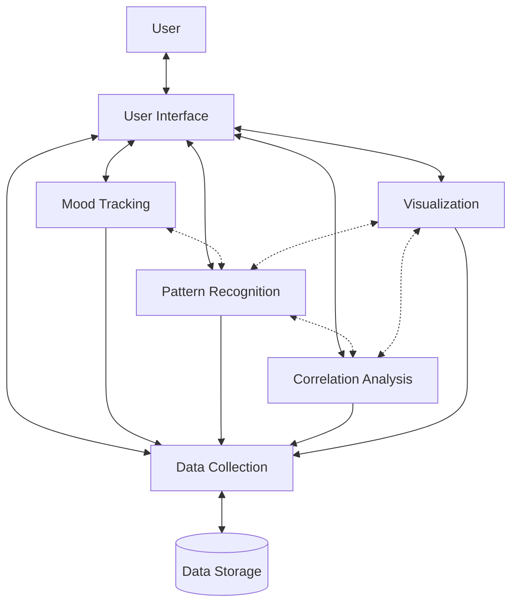
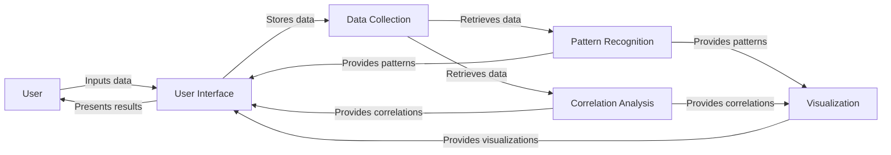
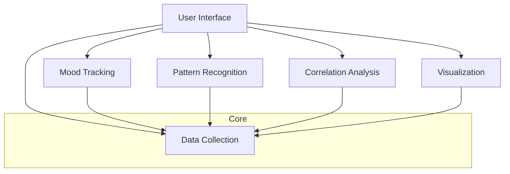
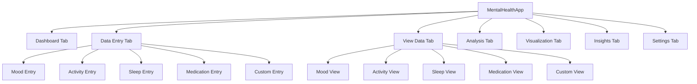

# Mental Health Pattern Recognition Assistant - System Patterns

## System Architecture

The Mental Health Pattern Recognition Assistant follows a modular architecture with clear separation of concerns. The system is organized into the following key components:



### Component Responsibilities

1. **Data Collection (DataCollector)**
   - Core data storage and retrieval functionality
   - Handles all data persistence operations
   - Provides a consistent API for other components to access data
   - Manages data structure and organization

2. **Mood Tracking (MoodTracker)**
   - Specialized functionality for mood data
   - Provides mood-specific analysis methods
   - Generates mood summaries and statistics
   - Builds on the Data Collection component

3. **Pattern Recognition (PatternRecognitionEngine)**
   - Identifies patterns in mental health data
   - Detects time-based patterns and trends
   - Performs clustering and pattern analysis
   - Generates insights based on identified patterns

4. **Correlation Analysis (CorrelationAnalyzer)**
   - Performs advanced statistical analysis
   - Identifies correlations between different factors
   - Conducts causality testing and multivariate analysis
   - Detects cyclical patterns in data

5. **Visualization (VisualizationGenerator)**
   - Creates visual representations of data and analysis results
   - Generates various types of charts and graphs
   - Produces comprehensive dashboards
   - Handles image file creation and management

6. **User Interface (UserInterface)**
   - Provides command-line interface for user interaction
   - Coordinates between other components
   - Presents data, visualizations, and insights to the user
   - Handles user input and navigation

## Key Technical Decisions

### 1. Data Storage Approach

The application uses a JSON-based file storage system rather than a traditional database. This decision was made to:
- Simplify installation and setup (no database dependencies)
- Ensure portability across systems
- Maintain user privacy by keeping data local
- Allow easy inspection and backup of data files

The trade-off is potentially slower performance with large datasets and limited query capabilities compared to a full database system.

### 2. Modular Component Design

The system is designed with highly modular components that:
- Have clear, single responsibilities
- Can be developed, tested, and maintained independently
- Interact through well-defined interfaces
- Allow for future extensions and replacements

This approach enhances maintainability and allows for incremental improvements to specific components without affecting the entire system.

### 3. Statistical Analysis Approach

The application uses a combination of:
- Basic statistical methods (means, correlations)
- Time series analysis (trends, cycles)
- Machine learning techniques (clustering)
- Causality testing (Granger causality)

This multi-faceted approach provides robust analysis while remaining computationally efficient for a desktop application.

### 4. Visualization Strategy

Visualizations are:
- Generated as static image files
- Created using matplotlib and seaborn libraries
- Designed with consistent color schemes and styling
- Organized in a dedicated output directory

This approach allows for easy viewing, sharing, and persistence of visualizations.

## Design Patterns in Use

### 1. Dependency Injection

Components accept their dependencies (like DataCollector) through their constructors, allowing for:
- Easier testing through mock dependencies
- Flexible component composition
- Reduced tight coupling between components

Example:
```python
def __init__(self, data_collector: Optional[DataCollector] = None):
    self.data_collector = data_collector or DataCollector()
```

### 2. Facade Pattern

The UserInterface class acts as a facade, providing a simplified interface to the complex subsystem of analysis and visualization components. This:
- Shields users from system complexity
- Provides a unified entry point to functionality
- Coordinates between subsystems

### 3. Strategy Pattern

Different analysis algorithms (pattern recognition, correlation analysis) are encapsulated in separate classes that can be used interchangeably, allowing for:
- Selection of appropriate algorithms at runtime
- Easy addition of new analysis strategies
- Isolation of algorithm-specific code

### 4. Builder Pattern

The VisualizationGenerator uses a builder-like approach to construct complex visualizations through a series of steps, providing:
- A clear process for creating complex objects
- Separation between construction and representation
- Flexibility in creating different visualization types

### 5. Repository Pattern

The DataCollector implements a repository pattern for data access, offering:
- A centralized data access interface
- Abstraction of data storage details
- Consistent data manipulation methods

## Component Relationships

### Data Flow



### Dependency Structure



The system follows a dependency structure where:
- All components depend on the core DataCollector
- The UserInterface coordinates between components
- Components do not directly depend on each other (except through the DataCollector)
- This structure minimizes coupling and enhances modularity

## Error Handling Strategy

The application implements a multi-layered error handling approach:

1. **Component-Level Validation**
   - Each component validates its inputs
   - Invalid operations return meaningful error states rather than exceptions when possible

2. **Graceful Degradation**
   - If a specific analysis fails, the system continues with other analyses
   - Visualizations adapt to missing data rather than failing completely

3. **User Feedback**
   - Clear error messages are presented to the user
   - Suggestions for resolving issues are provided when possible

4. **Data Integrity Protection**
   - Backup creation before potentially destructive operations
   - Validation of data structure before saving

## Extension Points

The system is designed with several extension points for future development:

1. **Additional Data Types**
   - The DataCollector can be extended to handle new types of data
   - Custom entry types allow for user-defined tracking categories

2. **New Analysis Algorithms**
   - Additional pattern recognition methods can be added
   - New correlation analysis techniques can be implemented

3. **Alternative Visualization Types**
   - The VisualizationGenerator can be extended with new visualization methods
   - Custom visualization themes can be implemented

4. **User Interface Enhancements**
   - A basic GUI prototype has been implemented using Tkinter
   - The GUI follows a similar component structure to the CLI
   - Web or mobile interfaces could be added while reusing core components
   - The modular architecture allows multiple UI types to coexist

## GUI Architecture

The graphical user interface follows a simple architecture:



The GUI implementation:
- Uses Tkinter for cross-platform compatibility
- Follows a tabbed interface design for intuitive navigation
- Maintains separation of concerns with the core components
- Provides a launcher script (run_gui.py) for easy access
